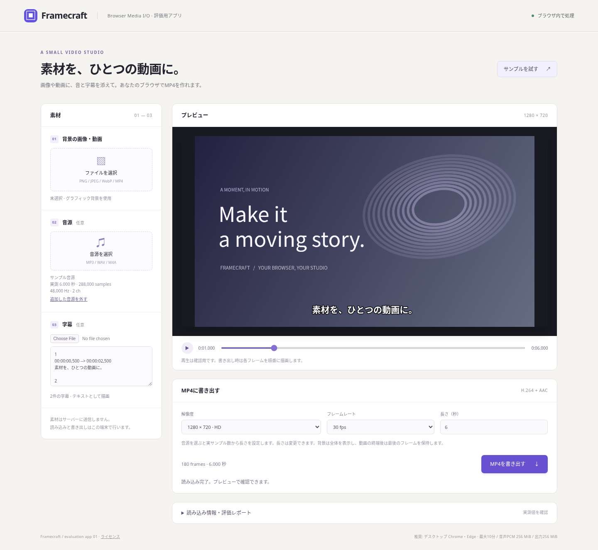

# Framecraft — ライブラリを実際に使って評価するアプリ

画像またはMP4に音源とSRT字幕を添えて、ブラウザ内でMP4を書き出す小さなアプリです。
ライブラリの公開APIを呼び出す独立した利用例として `apps/studio/` に置いています。
ライブラリ本体には、字幕・レイアウト・再生UIを追加していません。



## 自分の端末で起動する

Node.js 22.12以降とデスクトップChromeまたはEdgeを使用してください。
アプリの利用だけならFFmpegやPlaywrightのインストールは不要です。

```sh
git clone https://github.com/cityedge/browser-media-i-o.git
cd browser-media-i-o
npm ci
npm run app:dev
```

その端末のブラウザで **http://localhost:4174** を開きます。
既にcloneしている場合は `git pull` してから `npm ci` を実行してください。

1. 「サンプルを試す」で、6秒の音源と字幕を読み込みます。
2. 再生ボタンとスライダーで確認します。
3. 「MP4を書き出す」を押し、完了した動画を再生・ダウンロードします。
4. 自分の画像・MP4・音源・SRTに差し替えて、同じ操作を試します。
5. 問題があれば「読み込み情報・評価レポート」からJSONを保存します。

アプリは素材を外部へ送信せず、ブラウザにプロジェクトを永続保存しません。
再読み込みすると素材・設定・出力結果は消えます。
レポートにはブラウザ情報、設定、トラック情報、PCMのサンプル数、出力結果、直近のエラーが入ります。
素材本体・素材のファイル名・字幕本文は入れません。

## どのように合成するか

- 背景は画像1枚または動画1本。未指定ならアプリ内のグラフィック背景を描きます。
- 背景は縦横比を保ち、全体が入るように配置します。余白は黒です。
- 動画は時刻0から使用し、出力の方が長い場合は最終フレームを保持します。
- 追加音源があれば動画内の音声と置き換え、なければ動画内の音声を使います。
- 追加音源は `decodeAudio` の実サンプル数から長さを設定します。
- 動画内の音声は `audioBlocks` の時刻を保って配置し、先頭の無音区間も保持します。
- 素材変更時に長さを自動設定します。以後は手動変更でき、字幕の読み込みでは上書きしません。
- 長さは出力fpsのフレーム境界まで切り上げます。音声はその長さに切り詰め、または無音で補います。
- 字幕はUTF-8のSRT。時刻は `[開始, 終了)` として扱い、重なる字幕は一緒に表示します。
  HTML装飾やSRTの拡張設定は解釈せず、本文をテキストとして描きます。
- 出力はH.264＋AAC。ネイティブAAC非対応時はオプションのWASMエンコーダーを明示的に有効化します。
  音源がない場合は映像のみのMP4です。

## 評価で確認できたこと

Playwrightは**本番ビルドしたアプリの画面**からファイルを選択し、ボタンを押して出力します。
テスト用にアプリの内部関数を公開したり、エンコードをモックしたりしていません。

| 操作・素材 | 検証 |
|---|---|
| 10秒・30fpsのH.264/AAC MP4を読み込み、再出力 | FFmpegで300フレームすべての番号・順序・時刻、左右の音声マーカーを検査 |
| スライダーを前後に連続操作 | 最後に指定した時刻のフレームを表示。読み込みの重複エラーがないことを確認 |
| 長さを5.016秒と申告するMP3 | デコード結果の10秒・480,000サンプルを採用 |
| 画像＋MP3＋SRT | プレビューと出力動画の字幕を画素で検査。表示する時刻・消える時刻も検査 |
| 動画より音声が250ms遅いMP4 | 出力でも音声の時間差を保持。映像の終端後は最終フレームを保持 |
| 書き出しの中止と再実行 | 再実行で正常なMP4が完成 |
| 不正なMP4・不正なSRT | エラーを表示し、修正後に復帰。不正MP4で直前の素材を失わない |
| 音声なし・設定変更後・狭い画面 | 映像のみの出力、古い出力の無効化、横方向にはみ出さない表示を確認 |

アプリ内の出力確認は `probe` でパケット数を比較する簡易確認です。
全映像フレームのデコード検査と音声タイミング検査は、開発時のFFmpegテストが担当します。
パケット数が等しいことだけで、内容まで正しいとは判断していません。

## 組み込みで分かった実用上の注意

**AACの初期化中に中止すると、音声書き込みが待ち続ける不具合を検出・修正しました。**
AAC拡張が初期化中のWorkerを終了すると、その初期化Promiseが完了しなくなることが原因でした。
ライブラリは中止要求で新しい入力を直ちに止め、処理中のバックエンド操作が完了してから終了処理を行います。
`AbortSignal` と `writer.cancel()` の両方で未完了の書き込みが終了し、再度出力できることを回帰テストにしました。
依存ライブラリのソースは変更していません。

また、次の処理は利用アプリ側で明示する必要がありました。

1. **連続シークの処理順序。** 同じ `MediaInput` に同時読み込みはできません。
   プレビューは要求をまとめるループを持ち、出力は別の入力ハンドルを使用します。
2. **音源と動画内音声の違い。** 単独音源には `decodeAudio` が便利ですが、
   動画内の音声は元の時刻を保つ必要があるため、`audioBlocks` を使ってPCMを配置します。
3. **完成MP4の扱い。** 設定を変えた際は古い結果を無効にし、Blob URLを解放します。
   中止・失敗時も出力用の入力ハンドルを閉じます。
4. **AAC対応の環境差。** このLinux ChromiumではWASMのAAC拡張を使用しました。
   拡張の配布サイズは約1MB（gzip約261KB）あり、必要になるまで別チャンクとして読み込みます。

次の評価候補は、スマートフォンの回転付き／可変fps動画、異なるサンプルレートの音源、
長尺・高解像度の素材での処理時間とメモリ、Workerへ処理を移した場合のUI応答性です。
未検証の素材まで問題がないことを保証するものではありません。

## このアプリの範囲

評価を始めやすくするため、入力・出力の長さは最大10分、音声PCMは256 MiB、Blob出力は256 MiBです。
動画内音声と追加音源を同時に保持する場合などは、総メモリがこれら個別の上限を超えます。
`decodeAudio` のPCM上限確認はデコード後なので、ピークメモリを制限するものではありません。
動画の全フレームをメモリに展開することはありません。

複数クリップの編集、音声ミックス、字幕の装飾UI、プロジェクト保存、ストリーム保存は含みません。
スマホ・Safari・Firefoxでの動作保証や公開サイトへのデプロイも、この追加には含めていません。

## ビルドとテスト

```sh
npm run app:build      # apps/studio/dist/ に静的サイトを生成
npm run app:preview    # ビルド結果を localhost:4174 で確認
npm run test:app       # 本番ビルド + Playwrightのアプリテスト6件
npm test              # 既存39件 + 0.2追加の入出力検証 + 型検査
```

テストにはFFmpeg／ffprobeとChromiumが必要です。詳細は[README](../README.md#テスト)を参照してください。
アプリテストの動画・JSON・スクリーンショットは `test-results/app/`、
HTMLレポートは `playwright-report/app/` に出力します。

`apps/studio/dist/` はHTTPSの静的ホスティングへ配置できます。
HTMLを `file://` で直接開く使い方は対象外です。公開する場合は
[第三者ライセンス](../THIRD_PARTY_NOTICES.md)と依存コードのソース提供条件を引き継いでください。

## ソースの分担

| ファイル | 責務 |
|---|---|
| `apps/studio/main.ts` | 素材の読み込み、プレビュー・再生、書き出し、キャンセル、レポート |
| `apps/studio/composition.ts` | 画像・動画の配置、SRT解析・描画、時刻付きPCMの配置、サンプル素材 |
| `tests/app/studio.spec.ts` | 画面を使った操作と独立した出力検査 |
| `src/` | 汎用ライブラリ。本アプリからはパッケージの公開エントリーだけをimport |
