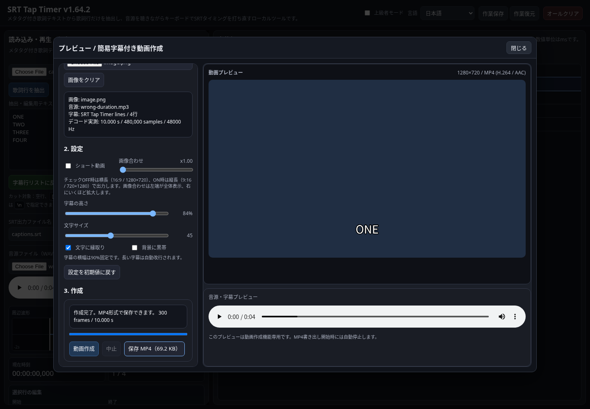

# SRT Tap TimerへのMP4出力組み込みテスト

[SRT Tap Timer](https://github.com/cityedge/srt-tap-timer) の動画作成機能を、
Browser Media I/Oによる **H.264＋AAC / 30fpsのMP4出力** に変更しました。
横長・縦長、画像合わせ、字幕の位置・文字サイズ・縁取り・黒帯を引き継ぎます。

SRT Tap Timer側へのプッシュはGitHubからHTTP 403で拒否されたため、
この接続済みリポジトリから、動作確認済みのZIPと適用パッチを提供します。



## 試す

1. [検証版ZIP](SRT-Tap-Timer-MP4-test.zip) をダウンロードして展開します。
2. `index.html` と `vendor/` を同じフォルダに置きます。
3. そのフォルダで `python3 -m http.server 4180`（Windowsは `py -m http.server 4180`）を実行します。
4. Chrome／Edgeで `http://localhost:4180` を開きます。
5. 音源と完成したSRTを読み込み、「プレビュー / 動画作成」で画像を選びます。
6. 「動画作成」→「保存 MP4」で出力できます。

利用にnpmインストールや外部FFmpegは不要です。必要なコードはZIPに同梱しています。
細かな変更内容と開発者向けの再テスト手順は、ZIP内の `MP4_EVALUATION.md` を参照してください。

## 検証結果

2026-10-01、Chromium 151.0.7922.173でPlaywright **6件成功**。スキップ・再試行なしです。
[機械可読の検証結果](verification.json)も保存しています。

- 横長1280×720、縦長720×1280ともに10秒・300フレームを出力。
- 全フレームの時刻と字幕の有無、縦長動画の画像拡大・字幕黒帯をFFmpegで検査。
- 左右の音声マーカーを入力の独立デコード結果と比較し、追加のずれは5ms以内。
- 5.016秒と申告するMP3を、実測10秒・480,000サンプルとして処理。
- 録画APIとプレビュー再生を使わずに生成。ページ読み込み後にオフラインにした状態でも出力。
- 中止・再実行、不正音源からの復帰、SRTと作業ファイルの保存・復元を確認。

残る課題は、ヘッダー不正音源での**編集画面・プレビューの時間表示**です。
MP4は実測時間で出力しますが、既存プレイヤーの表示はブラウザ依存です。
ローカルHTMLを直接開く `file://` 経路は、このクラウドのブラウザ管理ポリシーで拒否されたため未確認です。

## 元リポジトリへ適用する

[適用パッチ](mp4-export.patch) は、SRT Tap Timerの元コミット
`87a11c8a8d6312a06596dc7172a337662dc1f525` を基準にしています。
別のチェックアウトに適用し、実装コミットと同一のファイル一式になることを確認済みです。

```sh
git clone https://github.com/cityedge/srt-tap-timer.git srt-tap-timer-mp4
cd srt-tap-timer-mp4
git switch -c test/browser-mp4 87a11c8a8d6312a06596dc7172a337662dc1f525
git am /path/to/mp4-export.patch
```

その後、書き込み権限のある環境から検証ブランチをプッシュできます。
依存ライブラリのソース・ライセンス・ビルド手順はZIP内の `vendor/` とスクリプトに含めています。
